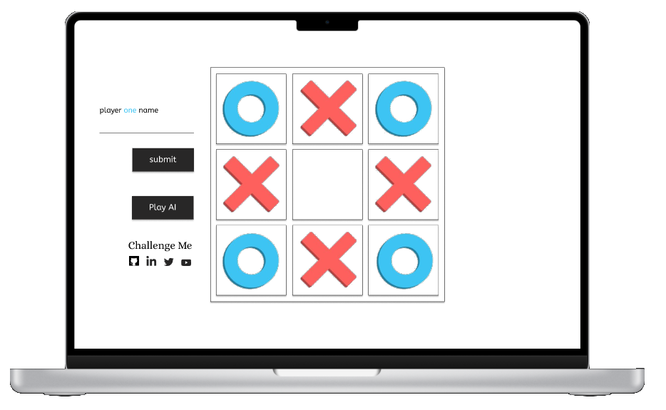

# Tic-Tac-Toe

## Purpose
Tic Tac Toe game implemented in JavaScript as part of [The Odin Project](https://www.theodinproject.com/paths/full-stack-javascript/courses/javascript/lessons/library) Curriculum

## Requirements

## Technologies

- HTML5
- CSS3
- JavaScript

## Live Version
https://mogoatlhe.github.io/tic-tac-toe

## Design

## Lessons Learnt / Challenges Faced
